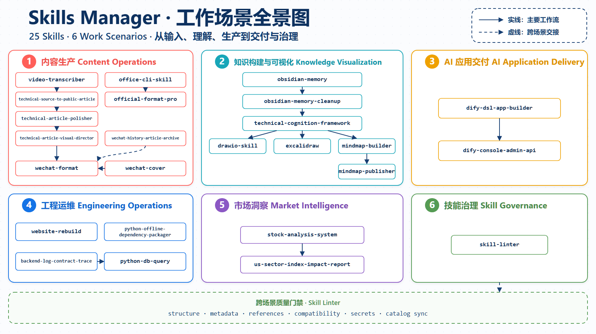

# skills-manager

按业务场景组织的可复用 AI agent skills 仓库，兼容 Codex、Claude、Gemini 和 GLM。技能执行流程以各自的 `SKILL.md` 为准，根目录只保留项目入口，详细说明统一维护在 `docs/`。



## 快速开始

1. 从 [技能索引](docs/skill-index.md) 选择最接近业务目标的 skill。
2. 完整阅读目标 `SKILL.md`。
3. 按 skill 要求加载 `scripts/`、`references/`、`assets/` 或模板。
4. 默认把生成产物写入 `output/<skill-name>/`。

通用调用方式：

```text
请先阅读 AGENTS.md，再阅读 <skill-path>/SKILL.md，并严格按该 skill 的流程完成任务。
```

## 业务场景

| 场景 | 目录 | 主要能力 |
|---|---|---|
| 内容运营 | `skills/content-operations/` | 转写、技术来源成文、文章润色、视觉策划、公众号排版、封面与历史文章归档 |
| 知识可视化 | `skills/knowledge-visualization/` | 支持多关键词相关度检索的 Obsidian 外部记忆、技术认知框架、draw.io、Excalidraw、离线思维导图与静态发布 |
| AI 应用交付 | `skills/ai-application-delivery/` | Dify 应用创建、DSL 设计、导入、更新与验证 |
| 工程运维 | `skills/engineering-operations/` | 数据库安全查询、后端日志与数据契约追踪 |
| 市场研究 | `skills/market-intelligence/` | 股票技术分析、美股行业复盘与跨市场影响研究 |
| 技能治理 | `skills/skill-governance/` | skill 结构、元数据、链接、兼容入口与敏感信息检查 |

完整目录树和迁移映射见 [业务场景目录说明](docs/directory-structure.md)。

## 文档

- [技能索引](docs/skill-index.md)：正式的仓库技能目录和使用场景。
- [业务场景目录说明](docs/directory-structure.md)：目录树、场景边界和维护规则。
- [仓库操作指南](docs/repository-operations.md)：调用、Python 启动器、校验、输出和安全约定。
- [平台兼容说明](docs/platform-compatibility.md)：Codex、Claude、Gemini、GLM 的入口和差异。

## 常用入口

- 技术来源转公众文章：[`skills/content-operations/technical-source-to-public-article`](skills/content-operations/technical-source-to-public-article/SKILL.md)
- 技术文章视觉策划：[`skills/content-operations/technical-article-visual-director`](skills/content-operations/technical-article-visual-director/SKILL.md)
- 微信公众号排版：[`skills/content-operations/wechat-format`](skills/content-operations/wechat-format/SKILL.md)
- Obsidian 外部记忆：[`skills/knowledge-visualization/obsidian-memory`](skills/knowledge-visualization/obsidian-memory/SKILL.md)，支持多关键词 All/Any 匹配与相关度排序
- 技术认知框架：[`skills/knowledge-visualization/technical-cognition-framework`](skills/knowledge-visualization/technical-cognition-framework/SKILL.md)
- Dify Console API：[`skills/ai-application-delivery/dify-console-admin-api`](skills/ai-application-delivery/dify-console-admin-api/SKILL.md)
- Dify DSL Builder：[`skills/ai-application-delivery/dify-dsl-app-builder`](skills/ai-application-delivery/dify-dsl-app-builder/SKILL.md)
- Dify DSL 导入规则：[`skills/ai-application-delivery/dify-dsl-app-builder/dsl-import-rules.md`](skills/ai-application-delivery/dify-dsl-app-builder/dsl-import-rules.md)

## 根目录入口

`README.md` 和 `AGENTS.md` 是共享入口；`CLAUDE.md`、`GEMINI.md`、`GLM.md` 为对应客户端保留自动发现入口。详细平台规则不在根目录重复维护，统一见 [平台兼容说明](docs/platform-compatibility.md)。

## 校验

```powershell
.\scripts\run-python.ps1 .\skills\skill-governance\skill-linter\scripts\lint_skill.py . --repo-root .
.\scripts\run-python.ps1 .\skills\ai-application-delivery\quick_validate.py
```

更多校验命令见 [仓库操作指南](docs/repository-operations.md)。
