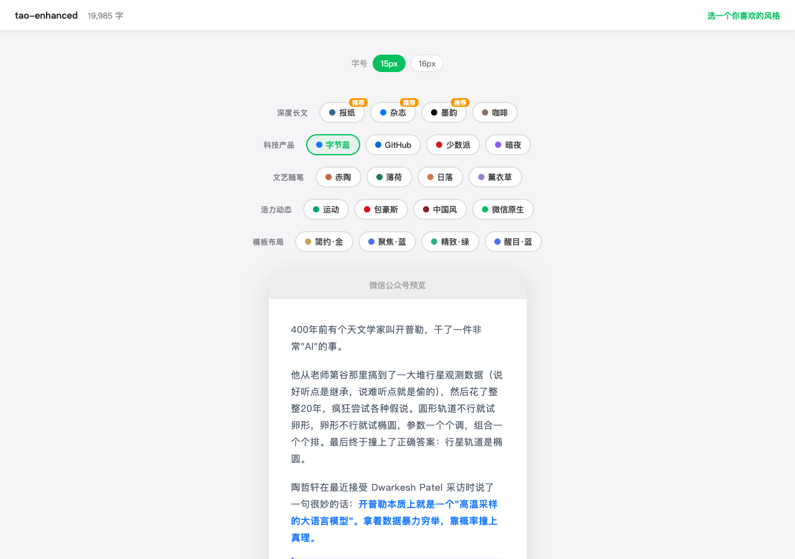

# wechat-format

A Claude Code skill for the full WeChat Official Account (公众号) publishing pipeline: **Format** → **Cover** (optional) → **Publish** — with 26 themes, a visual gallery picker, AI content enhancement, and one-click publishing to drafts.

**[中文说明](README_CN.md)**


## What It Does

1. **Markdown → WeChat HTML**: Converts standard Markdown into inline-styled HTML that works in WeChat's editor (no `<style>` tags, no classes — everything inline)
2. **26 Themes**: Organized into 8 scenario-based categories
3. **Visual Gallery**: Preview all 26 themes with your actual article in a browser, then pick one
4. **AI Content Enhancement**: Auto-detects dialogue, key quotes, and image sequences — wraps them in styled containers
5. **One-Click Publish**: Uploads images to WeChat CDN and pushes the article to your drafts



## Quick Start

Windows PowerShell:

```powershell
$Python = Join-Path $env:USERPROFILE ".cache\codex-runtimes\codex-primary-runtime\dependencies\python\python.exe"
$env:PYTHONIOENCODING = 'utf-8'
& $Python .\scripts\check_dependencies.py --install
& $Python .\scripts\article_workflow.py --input article.md --bytedance-preview --cover
```

Portable shell:

```bash
# Install
cd ~/.claude/skills/
git clone <repo-url> wechat-format
python3 wechat-format/scripts/check_dependencies.py --install

# Default repo-local repeated workflow
python3 scripts/article_workflow.py --input article.md --bytedance-preview --cover

# Manual gallery-only formatting
python3 scripts/format.py --input article.md --gallery

# Format with a specific theme
python3 scripts/format.py --input article.md --theme newspaper

# Run the workflow without opening browser windows
python3 scripts/article_workflow.py --input article.md --theme apple-code --no-open

# Publish to WeChat drafts
python3 scripts/publish.py --dir ./.tmp/article-name/ --cover cover.jpg

# Or format and publish from Markdown through the same ignored output path
python3 scripts/publish.py --input article.md --output ./.tmp --theme newspaper --cover cover.jpg
```

## Using with Claude Code

Just say:

```
排版这篇文章 /path/to/article.md
```

Claude will use the repo-local workflow script by default:

1. Run dependency checks
2. Generate terminology-polished, structured, and enhanced Markdown artifacts
3. Open the theme gallery, unless you specify a theme
4. Save the final theme output and manifest in a predictable workflow folder
5. Optionally generate a cover or publish to WeChat drafts

## Repo-local Workflow Script

`scripts/article_workflow.py` is the default path for repeated article packaging runs. It wraps the local workflow into one command:

1. Copy the source article into a stable workflow folder
2. Generate a terminology-polished Markdown draft plus a standalone terminology change table
3. Generate `structured` and `enhanced` Markdown with the `ai` config from `config.json`
4. Open the 26-theme gallery flow
5. Save the chosen final theme output into a predictable directory
6. Optionally emit a ByteDance preview and cover artifact

Default output layout:

```text
.tmp/article-workflows/<article-slug>/
  source/
  markdown/
    <article>-polished.md
    <article>-terminology-changes.md
  render/
  gallery/
  selection/
  final/<theme>/
  bytedance/
  cover/
  manifest.json
```

PowerShell:

```powershell
$Python = Join-Path $env:USERPROFILE ".cache\codex-runtimes\codex-primary-runtime\dependencies\python\python.exe"
$env:PYTHONIOENCODING = 'utf-8'
& $Python .\scripts\article_workflow.py --input ..\..\article.md --bytedance-preview --cover
```

Portable shell:

```bash
PYTHONIOENCODING=utf-8 python3 ./scripts/article_workflow.py --input ../../article.md --bytedance-preview --cover
```

Notes:

- After terminology polishing, the script pauses for manual confirmation before continuing to the structured/enhanced steps.
- If `--theme` is omitted, the script opens the gallery and then prompts in the terminal for the selected theme ID.
- If `ai.url`, `ai.api_key`, or `ai.model` is missing in `config.json`, pass `--skip-ai` or provide `--structured-input` / `--enhanced-input`.
- Use `--skip-terminology` when you want to keep the source text unchanged and only run the later formatting steps.
- Use `--auto-accept-terminology` when you need a non-interactive run after the terminology step.

## Reformat Archived WeChat Articles

If the source article was archived with `wechat/wechat-history-article-archive`, use that skill's bridge script instead of copying `article.md` by hand. The bridge keeps sibling `images/` and `meta.json` with the staged Markdown, then calls `scripts/article_workflow.py`.

From `wechat/wechat-format/` on Windows PowerShell:

```powershell
$Python = Join-Path $env:USERPROFILE ".cache\codex-runtimes\codex-primary-runtime\dependencies\python\python.exe"
$env:PYTHONIOENCODING = 'utf-8'
& $Python `
  ..\wechat-history-article-archive\scripts\reformat_archived_articles.py `
  --archive-dir ..\wechat-history-article-archive\output\archive `
  --article 1 `
  --theme apple-code `
  --skip-ai `
  --no-open `
  --non-interactive
```

Portable shell:

```bash
PYTHONIOENCODING=utf-8 python3 ../wechat-history-article-archive/scripts/reformat_archived_articles.py \
  --archive-dir ../wechat-history-article-archive/output/archive \
  --article 1 \
  --theme apple-code \
  --skip-ai \
  --no-open \
  --non-interactive
```

Linked output structure:

```text
../wechat-history-article-archive/.tmp/reformat-inputs/
  <archive-article-slug>/
    <archive-article-slug>.md
    images/
    meta.json
  reformat-manifest.json

.tmp/article-workflows/<archive-article-slug>/
  source/
  markdown/
  render/
  gallery/
  selection/
  final/<theme>/
  bytedance/
  cover/
  manifest.json
```

## Manual Gallery Path

Keep using `scripts/format.py` when you only need theme preview/rendering, when you already prepared the enhanced Markdown yourself, or when you are debugging a formatter issue:

```bash
python3 scripts/format.py --input article.md --gallery --recommend newspaper magazine coffee-house
python3 scripts/format.py --input article.md --theme newspaper
```

Windows PowerShell:

```powershell
& $Python .\scripts\format.py --input article.md --gallery --recommend newspaper magazine coffee-house
& $Python .\scripts\format.py --input article.md --theme newspaper
```

## Themes (26)

### Deep Reading (3)

| Theme | ID | Style |
|-------|-----|-------|
| Newspaper | `newspaper` | NYT-style serif, serious |
| Magazine | `magazine` | Extra whitespace, editorial |
| Coffee | `coffee-house` | Brown warm tones |

### Tech & Product (4)

| Theme | ID | Style |
|-------|-----|-------|
| Apple Code | `apple-code` | macOS dark code window with a pink-purple gradient frame |
| GitHub | `github` | Developer-friendly, light code blocks |
| ByteDance | `bytedance` | Blue-teal gradient, modern tech |
| SSPAI | `sspai` | Chinese tech media red |

### Lifestyle & Inspiration (5)

| Theme | ID | Style |
|-------|-----|-------|
| Terracotta | `terracotta` | Warm orange, rounded headers |
| Mint | `mint-fresh` | Mint green, fresh |
| Sunset | `sunset-amber` | Warm amber tones |
| Lavender | `lavender-dream` | Purple dreamy |
| Chinese | `chinese` | Vermillion red, classical |

### Active & General (2)

| Theme | ID | Style |
|-------|-----|-------|
| Sports | `sports` | Gradient stripes, energetic |
| WeChat Native | `wechat-native` | WeChat green |

### Template Series (12)

| Category | IDs | Style |
|----------|-----|-------|
| Minimal Business | `minimal-blue` / `minimal-navy` / `minimal-red` | Undecorated headings for business, tech, and professional content |
| Brand Focus | `focus-blue` / `focus-gold` / `focus-red` | Centered headings with top/bottom lines for branding and marketing |
| Elegant Magazine | `elegant-blue` / `elegant-green` / `elegant-navy` | Double side borders and gradient table headers for premium editorial content |
| Bold Announcement | `bold-blue` / `bold-green` / `bold-navy` | Filled headings and h3 color blocks for news, notices, and key messages |

## Container Syntax

Enhance your Markdown with these containers before formatting:

```markdown
:::dialogue[Interview Title]
Alice: Hello there
Bob: Hi, how are you?
:::

:::gallery[Screenshots]


:::

> [!important] Key Insight
> This is the important takeaway

> [!tip] Pro Tip
> A useful tip for readers
```

## Configuration

Formatting works without `config.json`. If the file does not exist, the scripts use built-in defaults and write output to the ignored `.tmp/` directory inside the skill directory.

For publishing, comment replies, cover generation, or custom output paths, copy and edit `config.json`:

```bash
cp config.example.json config.json
```

```json
{
  "output_dir": "./.tmp",
  "vault_root": "/path/to/your/obsidian/vault",
  "image_search_paths": [],
  "settings": {
    "default_theme": "newspaper",
    "auto_open_browser": true
  },
  "wechat": {
    "app_id": "YOUR_APP_ID",
    "app_secret": "YOUR_APP_SECRET",
    "author": "Author Name"
  },
  "cover": {
    "output_dir": "~/Documents/covers",
    "image_generation_script": ""
  },
  "ai": {
    "url": "",
    "api_key": "",
    "model": ""
  }
}
```

- `wechat` section is only needed for publishing and comment replies; formatting works without it
- `cover` section is only needed for cover image generation
- Get AppID/AppSecret from: WeChat Official Account Admin → Settings → Basic Configuration
- **Important**: Add your public IP to the WeChat IP whitelist, otherwise API calls will fail with error 40164

## Cover Image Generation

This repo includes a complete cover image generator in `wechat-cover/`. It calls the Gemini Image API (or compatible third-party gateways) to produce WeChat cover images (2.35:1 ratio, Notion illustration style).

### Setup

1. Copy `wechat-cover/config.example.json` -> `wechat-cover/config.json`
2. Fill in your API credentials:

```json
{
  "output_dir": "~/Documents/covers",
  "settings": {
    "base_url": "https://YOUR_PROVIDER/v1",
    "model": "gemini-3-pro-image-preview"
  },
  "secrets": {
    "api_key": "YOUR_API_KEY"
  }
}
```

3. Generate a cover:

```bash
python3 scripts/generate.py \
  --config wechat-cover/config.json \
  --prompt-file prompt.md \
  --out cover.jpg
```

Windows PowerShell:

```powershell
& $Python .\scripts\generate.py `
  --config .\wechat-cover\config.json `
  --prompt-file .\prompt.md `
  --out .\cover.jpg
```

Or with Claude Code, just say: `给这篇文章配个封面`

See `wechat-cover/SKILL.md` for the full prompt template and workflow details.

## How WeChat Compatibility Works

WeChat's editor strips `<style>` tags and CSS classes. This tool:

- **CJK spacing fix**: Auto-adds spaces between Chinese and English/numbers
- **Bold punctuation fix**: Moves Chinese punctuation outside bold markers (`**text，**` → `**text**，`)
- Writes all styles as inline `style="..."` attributes on every element
- Converts `<ul>/<ol>` to `<section>` + flexbox (WeChat mangles native lists)
- Transforms external links `[text](url)` into footnotes (WeChat blocks external links)
- Processes `![[image.jpg]]` Obsidian wiki-links and standard `` references
- Renders callout blocks (`[!tip]`, `[!important]`, `[!warning]`) with distinct colors
- Converts dialogue blocks into chat-bubble layouts

## Requirements

- Python 3
- `markdown` library
- `requests` library (for publishing)

## License

MIT
