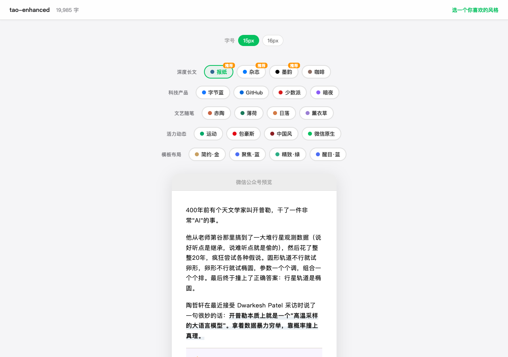

# xiaohu-wechat-format

Claude Code 公众号完整发布管线：**排版** → **封面**（可选）→ **推送**，一句话搞定。

**[English README](README.md)**



## 功能

- **排版引擎**：Markdown 转微信公众号兼容的内联样式 HTML
- **26 套主题**：8 大场景分类（深度阅读 / 技术产品 / 生活灵感 / 活力通用 / 极简商务 / 品牌聚焦 / 精致杂志 / 醒目公告），可视化画廊选择
- **AI 内容增强**：自动识别对话体、金句、连续图片，套用 dialogue / callout / gallery 容器
- **CJK 排版修复**：中英文自动加空格、加粗标点自动移出标记
- **图片处理**：自动处理 Obsidian `![[image]]` 和标准 Markdown `` 引用
- **外链转脚注**：微信不支持外链，自动转文末脚注
- **封面图生成**：内置 Gemini API 生图脚本 + 提示词模板，一步出图
- **一键发布**：自动上传图片到微信 CDN + 推送到草稿箱
- **主题画廊**：浏览器中用真实文章预览 26 个全量主题，点选即用

## 安装

```bash
cd ~/.claude/skills/
git clone https://github.com/xiaohuailabs/xiaohu-wechat-format.git
python3 xiaohu-wechat-format/scripts/check_dependencies.py --install
```

## 配置

纯排版无需 `config.json`。如果文件不存在，脚本会使用默认配置，并输出到 skill 目录下的 `output/`。

如果要推送草稿箱、评论回复、生成封面，或自定义输出目录，复制并编辑 `config.json`：

```bash
cp config.example.json config.json
```

```json
{
  "output_dir": "/tmp/wechat-format",
  "vault_root": "/path/to/your/obsidian/vault",
  "image_search_paths": [],
  "settings": {
    "default_theme": "newspaper",
    "auto_open_browser": true
  },
  "wechat": {
    "app_id": "你的AppID",
    "app_secret": "你的AppSecret",
    "author": "作者名"
  },
  "cover": {
    "output_dir": "~/Documents/covers",
    "image_generation_script": ""
  },
  "ai": {
    "url": "",
    "api_key": "",
    "model": ""
  }
}
```

- `wechat` 部分仅推送和评论回复时需要，纯排版可以不填
- `cover` 部分仅生成封面时需要（详见下方封面配置）
- 获取 AppID 和 AppSecret：微信公众号后台 → 设置与开发 → 基本配置
- **重要**：需要把你的公网 IP 加到公众号后台的 IP 白名单里，否则 API 调用会报 40164 错误

## 使用

在 Claude Code 里直接说：

```
排版这篇文章 /path/to/article.md
```

### 主题画廊（推荐）

```bash
python3 scripts/format.py --input article.md --gallery --recommend newspaper magazine coffee-house
```

在浏览器中用真实文章预览 26 个全量主题，选好后回到 Claude 说主题名。

### 指定主题排版

```bash
python3 scripts/format.py --input article.md --theme newspaper
```

### 推送到公众号

```bash
python3 scripts/publish.py --dir /tmp/wechat-format/article-name/ --cover cover.jpg
```

## 主题一览

### 深度阅读（3 个）

| 主题 | 命令值 | 风格 |
|------|--------|------|
| 报纸 | newspaper | 纽约时报风，严肃深度 |
| 杂志 | magazine | 超大留白，品质长文 |
| 咖啡 | coffee-house | 棕色暖调，稳重温馨 |

### 技术产品（4 个）

| 主题 | 命令值 | 风格 |
|------|--------|------|
| 苹果代码 | apple-code | macOS 深色代码窗口，粉紫渐变外框 |
| GitHub | github | 开发者风，浅色代码块 |
| 字节蓝 | bytedance | 蓝青渐变，科技现代 |
| 少数派 | sspai | 中文科技媒体红 |

### 生活灵感（5 个）

| 主题 | 命令值 | 风格 |
|------|--------|------|
| 赤陶 | terracotta | 暖橙色，满底圆角标题 |
| 薄荷 | mint-fresh | 薄荷绿，清爽健康 |
| 日落 | sunset-amber | 琥珀暖调，温暖感性 |
| 薰衣草 | lavender-dream | 紫色梦幻，浪漫诗意 |
| 中国风 | chinese | 朱砂红，古典雅致 |

### 活力通用（2 个）

| 主题 | 命令值 | 风格 |
|------|--------|------|
| 运动 | sports | 渐变色带，活力动感 |
| 微信原生 | wechat-native | 微信绿，传统阅读 |

### 模板系列（12 个）

| 分类 | 命令值 | 风格 |
|------|--------|------|
| 极简商务 | minimal-blue / minimal-navy / minimal-red | 无装饰标题，适合商务/科技/专业内容 |
| 品牌聚焦 | focus-blue / focus-gold / focus-red | 居中标题+上下线，适合品牌/展示/营销内容 |
| 精致杂志 | elegant-blue / elegant-green / elegant-navy | 左侧双线边框+渐变表头，适合杂志/设计/高端内容 |
| 醒目公告 | bold-blue / bold-green / bold-navy | 填充标题+色块 h3，适合新闻/公告/重点内容 |

## 容器语法

文章中可使用以下容器增强排版：

```markdown
:::dialogue[对话标题]
张三：你好
李四：你好啊
:::

:::gallery[图片标题]


:::

> [!important] 核心观点
> 这里是重点内容

> [!tip] 小技巧
> 实用提示
```

## 封面图生成

仓库自带封面图生成器（`cover/` 目录），调用 Gemini Image API（或兼容的第三方网关）生成公众号封面图（2.35:1 Notion 插画风格）。

### 配置

1. 复制 `cover/config.example.json` → `cover/config.json`
2. 填写 API 信息：

```json
{
  "output_dir": "~/Documents/covers",
  "settings": {
    "base_url": "https://你的API地址/v1",
    "model": "gemini-3-pro-image-preview"
  },
  "secrets": {
    "api_key": "你的API密钥"
  }
}
```

3. 生成封面：

```bash
python3 scripts/generate.py \
  --config cover/config.json \
  --prompt-file prompt.md \
  --out cover.jpg
```

或者在 Claude Code 里直接说：`给这篇文章配个封面`

完整提示词模板和工作流详见 `cover/SKILL.md`。

## 自定义主题

在 `themes/` 目录下创建 JSON 文件。参考 `themes/newspaper.json`。

## 依赖

- Python 3
- `markdown` 库
- `requests` 库（推送到公众号时需要）

检测依赖：

```bash
python3 scripts/check_dependencies.py
```

安装缺失依赖：

```bash
python3 scripts/check_dependencies.py --install
```

## License

MIT
